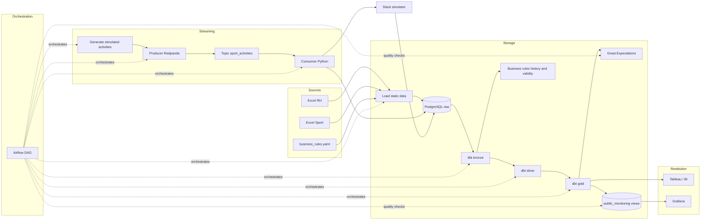

# Sport Data Solution - POC Avantages sportifs

POC Data Engineering complet pour démontrer un pipeline de bout en bout autour des avantages sportifs salariés.

Le projet couvre :
- ingestion de fichiers Excel RH et sport ;
- génération d'activités sportives simulées sur 12 mois ;
- streaming via Redpanda ;
- consommation et historisation des événements dans PostgreSQL ;
- transformations analytiques avec dbt selon une architecture `bronze / silver / gold` ;
- tests qualité avec `dbt` et `Great Expectations` ;
- sorties prêtes pour un outil BI comme Tableau ;
- rejeu historique lorsque les règles métier changent.

## Architecture



## Stack technique

- `PostgreSQL` : base analytique du POC.
- `Redpanda` : bus d'événements pour les activités sportives.
- `Python 3.11` : ingestion, simulation, producer, consumer, messages Slack simulés.
- `dbt-postgres` : transformations SQL et tests.
- `Great Expectations` : validation de cohérence sur les tables transformées.
- `Airflow` : orchestration des étapes d'ingestion et de transformation.
- `Docker Compose` : exécution locale reproductible.

## Structure du repo

```text
src/pipeline/                    Code Python du pipeline
src/orchestration/airflow/       DAGs et configuration Airflow
analytics/dbt/                   Projet dbt
infra/postgres/init/             Initialisation PostgreSQL
data/raw/                        Sources Excel fournies
data/generated/                  Activités simulées
data/exports/                    Exports CSV pour la BI
docs/                            Architecture, lexique et guide Tableau
```

## Pré-requis

- Docker et Docker Compose
- Facultatif en local hors Docker : Python 3.11

## Démarrage rapide

1. Copier la configuration :

```bash
cp .env.example .env
cp analytics/dbt/profiles.yml.example analytics/dbt/profiles.yml
```

2. Démarrer l'infrastructure :

```bash
docker compose up -d postgres redpanda redpanda-console
```

Pour lancer aussi Airflow :

```bash
docker compose up -d airflow-init airflow-webserver airflow-scheduler
```

Pour lancer aussi le monitoring Grafana :

```bash
docker compose up -d grafana
```

### Accéder à PostgreSQL

Une fois le conteneur démarré, vous pouvez ouvrir un shell `psql` directement dans PostgreSQL :

```bash
docker exec -it sport-postgres psql -U sport_user -d sport_data
```

Depuis `psql`, quelques commandes utiles :

```sql
\dn
\dt raw.*
\dt public_bronze.*
\dt public_silver.*
\dt public_gold.*
select * from public_gold.gold_kpi_finance;
select * from public_gold.gold_kpi_employee_status limit 10;
select * from public_gold.gold_slack_messages limit 10;
```

Pour quitter :

```sql
\q
```

Vous pouvez aussi vous connecter depuis votre machine si `psql` est installé localement :

```bash
psql -h localhost -p 5432 -U sport_user -d sport_data
```

Mot de passe par défaut :

```text
sport_pass
```

3. Construire les conteneurs applicatifs :

```bash
docker compose build pipeline dbt airflow
```

4. Charger les sources statiques :

```bash
docker compose run --rm pipeline python -m pipeline.config.load_business_rules
docker compose run --rm pipeline python -m pipeline.ingestion.load_to_postgres
```

5. Générer les activités simulées :

```bash
docker compose run --rm pipeline python -m pipeline.simulation.generate_strava_like_activities
```

6. Publier les événements dans Redpanda :

```bash
docker compose run --rm pipeline python -m pipeline.simulation.sport_activity_producer
```

7. Consommer les événements et générer les messages Slack simulés :

```bash
docker compose run --rm pipeline python -m pipeline.streaming.redpanda_consumer
```

8. Exécuter dbt :

```bash
docker compose run --rm dbt bash -lc "cp profiles.yml.example profiles.yml && dbt run && dbt test"
```

9. Lancer les validations Great Expectations :

```bash
docker compose run --rm --entrypoint bash pipeline -lc "python -m pipeline.data_quality.run_great_expectations"
```

Le script produit un rapport JSON dans :

```text
data/generated/great_expectations/
```

## Partie Airflow

Airflow orchestre la partie ingestion du projet. Il ne remplace ni les scripts Python, ni dbt, ni Redpanda. Il enchaîne les étapes, trace les exécutions et facilite une démonstration plus “industrialisation”.

### Service Airflow

La stack Airflow est définie dans [`docker-compose.yml`](/Users/papadou/Desktop/data_engineer/projets/p12-de/docker-compose.yml) et son image dans [`src/orchestration/airflow/Dockerfile`](/Users/papadou/Desktop/data_engineer/projets/p12-de/src/orchestration/airflow/Dockerfile).

Elle est séparée en trois services :
- `airflow-init` : initialise la metadata DB dans PostgreSQL et crée/réinitialise l'utilisateur admin ;
- `airflow-webserver` : expose l'UI sur `localhost:8081` ;
- `airflow-scheduler` : exécute la planification des DAGs.

L'interface web est disponible sur :

```text
http://localhost:8081
```

Le démarrage se fait avec :

```bash
docker compose up -d airflow-init airflow-webserver airflow-scheduler
```

### Identifiants Airflow

Le compte admin Airflow est créé automatiquement au démarrage via des variables d'environnement définies dans [`.env.example`](/Users/papadou/Desktop/data_engineer/projets/p12-de/.env.example).

Variables utilisées :
- `AIRFLOW_ADMIN_USERNAME`
- `AIRFLOW_ADMIN_PASSWORD`
- `AIRFLOW_ADMIN_FIRSTNAME`
- `AIRFLOW_ADMIN_LASTNAME`
- `AIRFLOW_ADMIN_EMAIL`

Exemple :

```env
AIRFLOW_ADMIN_USERNAME=admin_demo
AIRFLOW_ADMIN_PASSWORD=admin_demo_123
AIRFLOW_ADMIN_FIRSTNAME=Admin
AIRFLOW_ADMIN_LASTNAME=Demo
AIRFLOW_ADMIN_EMAIL=admin_demo@example.com
```

Une fois `docker compose up -d airflow-init airflow-webserver airflow-scheduler` exécuté, vous pouvez vous connecter avec ces identifiants sur :

```text
http://localhost:8081
```

## Monitoring

Un monitoring léger a été ajouté avec `Grafana` branché directement sur PostgreSQL.

Accès :

```text
http://localhost:3000
```

Identifiants par défaut :

```text
admin / admin
```

Variables disponibles dans [`.env.example`](/Users/papadou/Desktop/data_engineer/projets/p12-de/.env.example) :

- `GRAFANA_ADMIN_USER`
- `GRAFANA_ADMIN_PASSWORD`

Le dashboard provisionné automatiquement s'appelle :

- `Sport Data Monitoring`

Il permet de suivre :

- les runs Airflow récents et leurs statuts ;
- la volumétrie quotidienne des événements bruts et des activités valides ;
- le nombre d'employés actifs et éligibles au fil du temps ;
- le volume courant des tables clés du pipeline.

Les vues SQL utilisées par Grafana sont :

- `public_monitoring.monitoring_airflow_runs`
- `public_monitoring.monitoring_activity_volumes_daily`
- `public_monitoring.monitoring_table_row_counts`

### DAG principal

Le DAG est ici :
- [`src/orchestration/airflow/dags/sport_data_ingestion_dag.py`](/Users/papadou/Desktop/data_engineer/projets/p12-de/src/orchestration/airflow/dags/sport_data_ingestion_dag.py)

Nom du DAG :
- `sport_data_ingestion_pipeline`

Il orchestre les étapes suivantes :
- chargement des règles métier YAML ;
- ingestion des fichiers Excel RH et sport ;
- génération des activités simulées ;
- publication dans Redpanda ;
- consommation des événements ;
- exécution de `dbt run` ;
- exécution des validations `Great Expectations` ;
- exécution de `dbt test`.

Planification :
- tous les jours à `08:00`

Comportement par défaut :
- les tâches `load_business_rules` et `ingest_static_sources` sont skippées en exécution planifiée ;
- le DAG démarre alors directement à partir de la génération des activités ;
- la date logique Airflow du run (`ds`) devient le `process_date` utilisé par les scripts quotidiens.

Déclenchement manuel avec rechargement statique :
- depuis l'UI Airflow, vous pouvez lancer un `Trigger DAG` avec la configuration suivante :

```json
{
  "run_static_load": true,
  "process_date": "2026-05-01"
}
```

Dans ce cas, le DAG exécute aussi :
- `load_business_rules`
- `ingest_static_sources`

Déclenchement manuel pour un backfill journalier sans rechargement statique :

```json
{
  "run_static_load": false,
  "process_date": "2026-05-01"
}
```

Le paramètre `run_static_load` est déclaré directement dans le DAG comme un `Param` Airflow. Selon la version et la vue de l'interface, il peut donc apparaître comme un champ booléen dans le formulaire de déclenchement plutôt que comme du JSON libre.
Le paramètre `process_date` est lui aussi déclaré dans le DAG. Il permet de rejouer explicitement une journée donnée au lieu de dépendre uniquement de la date courante.
Les paramètres `start_date` et `end_date` permettent désormais de lancer un vrai backfill automatique sur une plage de dates. Quand ils sont fournis, les tâches de génération et de publication bouclent de `start_date` à `end_date`, puis la consommation Redpanda ne s'exécute qu'une seule fois à la fin pour absorber tout le lot. Quand ils sont absents, le DAG conserve son comportement journalier habituel.

Exemple de backfill sur une plage :

```json
{
  "run_static_load": false,
  "start_date": "2025-05-12",
  "end_date": "2026-05-11"
}
```

Priorité de résolution des dates :
- `start_date` / `end_date` si la plage est fournie
- sinon `process_date` pour un rejeu d'une seule journée
- sinon `ds` pour le run planifié quotidien

### Comment le branchement est défini

Le branchement est défini à deux niveaux dans le code du DAG :

1. la fonction `choose_static_branch()` lit `dag_run.conf` et retourne le `task_id` de la première tâche de la branche à suivre :
- `load_business_rules` si `run_static_load=true`
- `skip_static_load` sinon

2. les dépendances entre tâches définissent ensuite les deux chemins possibles :

```python
branch_static_load >> skip_static_load >> generate_activities
branch_static_load >> load_business_rules >> ingest_static_sources >> generate_activities
```

Cela signifie :
- branche courte : `branch_static_load -> skip_static_load -> generate_activities`
- branche complète : `branch_static_load -> load_business_rules -> ingest_static_sources -> generate_activities`

La décision est donc prise par `BranchPythonOperator`, mais les branches elles-mêmes sont définies par les lignes de dépendances `>>`.

### Utilisation en démo

1. démarrer l'infra :

```bash
docker compose up -d postgres redpanda redpanda-console airflow-init airflow-webserver airflow-scheduler
```

2. ouvrir Airflow :

```text
http://localhost:8081
```

3. activer le DAG `sport_data_ingestion_pipeline`

4. lancer un run manuel depuis l'interface

5. suivre les tâches :
- `branch_static_load`
- `skip_static_load` si `run_static_load=false`
- `load_business_rules`
- `ingest_static_sources`
- `generate_activities`
- `produce_redpanda_events`
- `consume_redpanda_events`
- `run_dbt`
- `test_dbt`

### Déclenchement manuel avec conf en ligne de commande

Si l'interface Airflow lance directement le DAG sans vous laisser éditer le JSON, vous pouvez déclencher le run depuis le terminal avec `--conf`.

Exécution par défaut avec skip du chargement statique :

```bash
docker exec -it sport-airflow-webserver airflow dags trigger sport_data_ingestion_pipeline \
  --conf '{"run_static_load": false, "process_date": "2026-05-01"}'
```

Exécution complète avec rechargement des règles métier et des fichiers Excel :

```bash
docker exec -it sport-airflow-webserver airflow dags trigger sport_data_ingestion_pipeline \
  --conf '{"run_static_load": true, "process_date": "2026-05-01"}'
```

Backfill automatique sur une plage de dates :

```bash
docker exec -it sport-airflow-webserver airflow dags trigger sport_data_ingestion_pipeline \
  --conf '{"run_static_load": false, "start_date": "2025-05-12", "end_date": "2026-05-11"}'
```

### Positionnement d'Airflow dans le projet

Dans ce POC, Airflow est utilisé uniquement comme orchestrateur d'ingestion et d'exécution.  
La logique métier reste dans dbt, et le streaming reste porté par Redpanda.

## Partie dbt

Le projet dbt se trouve dans [`analytics/dbt`](/Users/papadou/Desktop/data_engineer/projets/p12-de/analytics/dbt).  
dbt est utilisé pour porter toute la logique analytique et métier, en séparant clairement les transformations SQL de l'ingestion Python.

### Rôle de dbt dans le projet

- construire les couches `bronze`, `silver` et `gold` ;
- transformer les données brutes en tables analytiques exploitables ;
- appliquer les règles d'éligibilité ;
- produire les KPI de restitution ;
- exécuter les tests de qualité ;
- rendre le recalcul historique simple en cas de changement des règles métier.

### Structure des modèles

#### Bronze

La couche `bronze` expose les sources brutes chargées dans PostgreSQL.

Modèles principaux :
- `business_rules`
- `brz_rh_employees`
- `brz_sport_declarations`
- `brz_sport_activities`
- `brz_slack_messages`

#### Silver

La couche `silver` nettoie, type, normalise et enrichit les données.

Modèles principaux :
- `sil_employees`
  - typage des dates et montants
  - normalisation des modes de transport
  - calcul de la distance domicile-bureau
- `sil_sport_activities`
  - nettoyage du flux Redpanda
  - contrôle de validité des activités
- `sil_sport_declarations`
- `sil_employee_activity_yearly`
- `sil_employee_activity_joined`

#### Gold

La couche `gold` porte les sorties métier finales.

Modèles principaux :
- `gold_eligible_sport_bonus`
- `gold_eligible_wellbeing_days`
- `gold_kpi_finance`
- `gold_kpi_employee_status`
- `gold_slack_messages`
- `gold_quality_anomalies`

### Tests dbt

Les tests sont déclarés dans :
- [`models/bronze/schema.yml`](/Users/papadou/Desktop/data_engineer/projets/p12-de/analytics/dbt/models/bronze/schema.yml)
- [`models/silver/schema.yml`](/Users/papadou/Desktop/data_engineer/projets/p12-de/analytics/dbt/models/silver/schema.yml)
- [`models/gold/schema.yml`](/Users/papadou/Desktop/data_engineer/projets/p12-de/analytics/dbt/models/gold/schema.yml)

Tests standards utilisés :
- `not_null`
- `unique`
- `relationships`
- `accepted_values`

Tests personnalisés :
- [`non_negative`](/Users/papadou/Desktop/data_engineer/projets/p12-de/analytics/dbt/macros/test_non_negative.sql)
- [`positive_value`](/Users/papadou/Desktop/data_engineer/projets/p12-de/analytics/dbt/macros/test_positive_value.sql)

### Commandes dbt

Depuis [`analytics/dbt`](/Users/papadou/Desktop/data_engineer/projets/p12-de/analytics/dbt) :

```bash
dbt run
dbt test
```

Pour un recalcul complet :

```bash
dbt run --full-refresh
dbt test
```

### Workflow réel du projet

Avant d'exécuter dbt, il faut charger les règles métier YAML dans PostgreSQL :

```bash
cd /Users/papadou/Desktop/data_engineer/projets/p12-de
PYTHONPATH=src python -m pipeline.config.load_business_rules
```

Puis lancer dbt :

```bash
cd /Users/papadou/Desktop/data_engineer/projets/p12-de/analytics/dbt
dbt run
dbt test
```

Ce point est important : dbt consomme une table SQL `raw.business_rules_raw`, mais la source de vérité métier reste le fichier YAML [`src/pipeline/config/business_rules.yaml`](/Users/papadou/Desktop/data_engineer/projets/p12-de/src/pipeline/config/business_rules.yaml).

### Ce qu'il faut montrer en démo

Les fichiers les plus utiles à ouvrir pour expliquer dbt sont :
- [`dbt_project.yml`](/Users/papadou/Desktop/data_engineer/projets/p12-de/analytics/dbt/dbt_project.yml)
- [`models/sources.yml`](/Users/papadou/Desktop/data_engineer/projets/p12-de/analytics/dbt/models/sources.yml)
- [`models/silver/sil_employees.sql`](/Users/papadou/Desktop/data_engineer/projets/p12-de/analytics/dbt/models/silver/sil_employees.sql)
- [`models/gold/gold_eligible_sport_bonus.sql`](/Users/papadou/Desktop/data_engineer/projets/p12-de/analytics/dbt/models/gold/gold_eligible_sport_bonus.sql)
- [`models/gold/gold_eligible_wellbeing_days.sql`](/Users/papadou/Desktop/data_engineer/projets/p12-de/analytics/dbt/models/gold/gold_eligible_wellbeing_days.sql)
- les fichiers `schema.yml` pour les tests

## Tables clés

### Raw

- `raw.rh_employees_raw`
- `raw.sport_declarations_raw`
- `raw.sport_activities_stream_raw`
- `raw.slack_messages_raw`

### Silver

- `public_silver.sil_employees`
- `public_silver.sil_sport_activities`
- `public_silver.sil_employee_activity_yearly`
- `public_silver.sil_employee_activity_joined`

### Gold

- `public_gold.gold_eligible_sport_bonus`
- `public_gold.gold_eligible_wellbeing_days`
- `public_gold.gold_kpi_finance`
- `public_gold.gold_kpi_employee_status`
- `public_gold.gold_slack_messages`
- `public_gold.gold_quality_anomalies`

## Règles métier gérées

- Prime sportive = `5%` du salaire annuel brut.
- Distance maximale :
  - `15 km` pour `marche/running`
  - `25 km` pour `vélo/trottinette/autres`
- Jours bien-être = `5` si au moins `15` activités sur 12 mois glissants.
- Chaque activité consommée génère un message Slack simulé.

Les règles sont centralisées dans :
- [`src/pipeline/config/business_rules.yaml`](/Users/papadou/Desktop/data_engineer/projets/p12-de/src/pipeline/config/business_rules.yaml)

Puis chargées en base dans `raw.business_rules_raw` via :
- [`src/pipeline/config/load_business_rules.py`](/Users/papadou/Desktop/data_engineer/projets/p12-de/src/pipeline/config/load_business_rules.py)

## Rejeu historique

Le rejeu se fait en modifiant les règles, puis en relançant :

```bash
cd /Users/papadou/Desktop/data_engineer/projets/p12-de
source .venv/bin/activate
set -a
source .env
set +a

PYTHONPATH=src python -m pipeline.config.load_business_rules

cd analytics/dbt
dbt run --full-refresh
dbt test
```

Dans un POC, cette approche est suffisante pour recalculer l'historique analytique sans réécrire les sources brutes.

## Qualité

Tests dbt inclus :
- `not_null`
- `unique`
- `relationships`
- `accepted_values`
- tests personnalisés `non_negative` et `positive_value`

Tests Python inclus :
- helpers de distance
- normalisation de transport

## Dashboard attendu

Voir [`docs/powerbi_mockup.md`](/Users/papadou/Desktop/data_engineer/projets/p12-de/docs/powerbi_mockup.md).

## Guide Tableau

Pour une réalisation complète du dashboard dans Tableau à partir des tables `public_gold`, voir [`docs/tableau_dashboard_guide.md`](/Users/papadou/Desktop/data_engineer/projets/p12-de/docs/tableau_dashboard_guide.md).

## Lexique des données

Pour le lexique métier et analytique des couches `silver` et `gold`, voir [`docs/data_lexicon_silver_gold.md`](/Users/papadou/Desktop/data_engineer/projets/p12-de/docs/data_lexicon_silver_gold.md).

## Choix techniques

Voir [`docs/decisions.md`](/Users/papadou/Desktop/data_engineer/projets/p12-de/docs/decisions.md).
