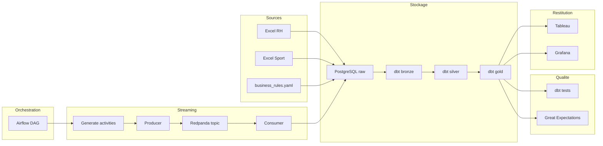

# Sport Data Solution

POC Data Engineering de bout en bout pour piloter des avantages salariés liés à la pratique sportive.

Le projet couvre :
- l'ingestion de fichiers RH, sport et règles métier ;
- la simulation d'activités sportives sur 12 mois ;
- le streaming via Redpanda ;
- les transformations analytiques `bronze / silver / gold` avec dbt ;
- les contrôles qualité avec `dbt test` et `Great Expectations` ;
- la restitution dans Tableau et le monitoring dans Grafana.

## Architecture



Le diagramme source est disponible dans [docs/architecture.mmd](/Users/papadou/Desktop/data_engineer/projets/p12-de/docs/architecture.mmd).

## Stack technique

- `PostgreSQL` : stockage analytique
- `Redpanda` : bus d'événements
- `Python 3.11` : ingestion, simulation, producer, consumer
- `dbt-postgres` : transformations et tests SQL
- `Great Expectations` : contrôles de qualité
- `Airflow` : orchestration du pipeline
- `Grafana` : monitoring
- `Tableau` : restitution BI
- `Docker Compose` : exécution locale

## Structure du repo

```text
src/pipeline/                    Scripts Python du pipeline
src/orchestration/airflow/       DAGs Airflow
analytics/dbt/                   Projet dbt
infra/postgres/init/             Initialisation PostgreSQL
data/raw/                        Sources Excel
data/generated/                  Données simulées et rapports
data/exports/                    Exports BI
docs/                            Documentation projet
```

## Démarrage rapide

1. Copier la configuration :

```bash
cp .env.example .env
cp analytics/dbt/profiles.yml.example analytics/dbt/profiles.yml
```

2. Démarrer l'infrastructure :

```bash
docker compose up -d postgres redpanda redpanda-console
docker compose up -d airflow-init airflow-webserver airflow-scheduler
docker compose up -d grafana
```

3. Construire les images applicatives :

```bash
docker compose build pipeline dbt airflow
```

4. Exécuter le pipeline manuellement :

```bash
docker compose run --rm pipeline python -m pipeline.config.load_business_rules
docker compose run --rm pipeline python -m pipeline.ingestion.load_to_postgres
docker compose run --rm pipeline python -m pipeline.simulation.generate_strava_like_activities
docker compose run --rm pipeline python -m pipeline.simulation.sport_activity_producer
docker compose run --rm pipeline python -m pipeline.streaming.redpanda_consumer
docker compose run --rm dbt bash -lc "cp profiles.yml.example profiles.yml && dbt run && dbt test"
docker compose run --rm --entrypoint bash pipeline -lc "python -m pipeline.data_quality.run_great_expectations"
```

## Services utiles

- Airflow : `http://localhost:8081`
- Redpanda Console : `http://localhost:8080`
- Grafana : `http://localhost:3000`
- PostgreSQL :

```bash
docker exec -it sport-postgres psql -U sport_user -d sport_data
```

Identifiants par défaut :
- PostgreSQL : définis dans `.env`
- Grafana : définis dans `.env`
- Airflow : définis dans [`.env.example`](/Users/papadou/Desktop/data_engineer/projets/p12-de/.env.example)

## Orchestration Airflow

Le DAG principal est [sport_data_ingestion_dag.py](/Users/papadou/Desktop/data_engineer/projets/p12-de/src/orchestration/airflow/dags/sport_data_ingestion_dag.py).

Il orchestre :
- le chargement des règles métier ;
- l'ingestion des fichiers statiques ;
- la génération et la publication des activités ;
- la consommation Redpanda ;
- `dbt run` ;
- `Great Expectations` ;
- `dbt test`.

Exemple de backfill manuel :

```json
{
  "run_static_load": false,
  "start_date": "2025-05-12",
  "end_date": "2026-05-11"
}
```

## Modèle de données

- `raw` : atterrissage des sources
- `public_bronze` : standardisation et historisation des règles
- `public_silver` : nettoyage et enrichissement
- `public_gold` : tables BI et KPI
- `public_monitoring` : vues pour Grafana

Tables clés :
- `public_silver.sil_employees`
- `public_silver.sil_sport_activities`
- `public_gold.gold_kpi_employee_status`
- `public_gold.gold_employee_benefit_timeline`
- `public_gold.gold_employee_map`

## Règles métier

La source de vérité est [business_rules.yaml](/Users/papadou/Desktop/data_engineer/projets/p12-de/src/pipeline/config/business_rules.yaml).

Le loader [load_business_rules.py](/Users/papadou/Desktop/data_engineer/projets/p12-de/src/pipeline/config/load_business_rules.py) charge :
- la version complète du YAML dans `raw.business_rules_raw` ;
- une vue paramétrique dans `raw.business_rule_parameters_raw`.

Les règles sont ensuite historisées dans dbt :
- `public_bronze.business_rules_history`
- `public_bronze.business_rules_validity`
- `public_bronze.business_rule_parameters_history`

## Documentation

- [architecture.md](/Users/papadou/Desktop/data_engineer/projets/p12-de/docs/architecture.md)
- [tableau_dashboard.md](/Users/papadou/Desktop/data_engineer/projets/p12-de/docs/tableau_dashboard.md)
- [data_lexicon_silver_gold.md](/Users/papadou/Desktop/data_engineer/projets/p12-de/docs/data_lexicon_silver_gold.md)
- [decisions.md](/Users/papadou/Desktop/data_engineer/projets/p12-de/docs/decisions.md)
